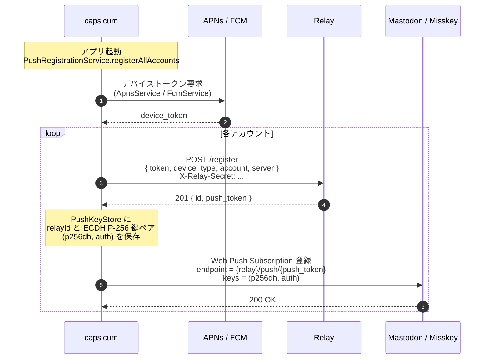
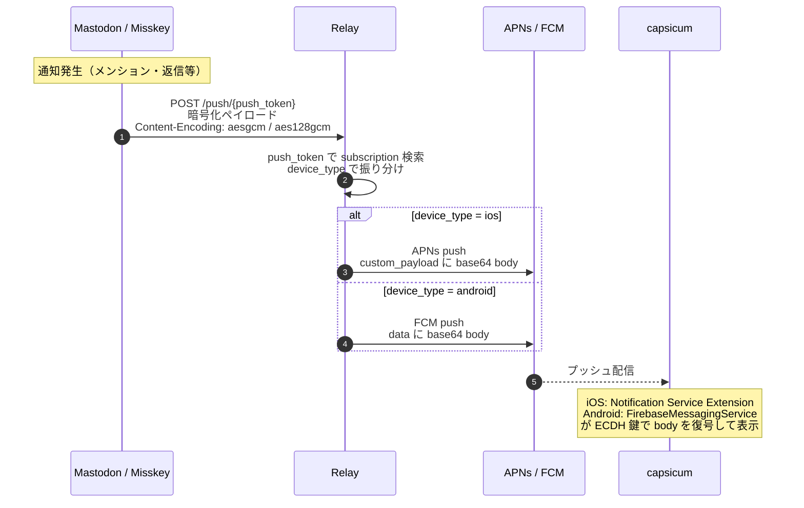
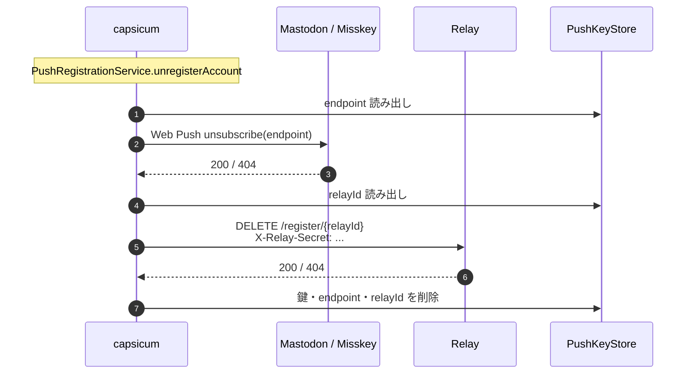

# capsicum アーキテクチャ設計

## パッケージ構成

Melos によるモノレポ。4パッケージ構成。

```text
packages/
  capsicum/              メインアプリ（UI・画面・DI・ルーティング）
  capsicum_core/         ドメインモデル・Adapter インターフェース・Feature mixin（pure Dart）
  capsicum_backends/     Mastodon / Misskey API 実装・MulukhiyaService・Probing
  fediverse_objects/     API レスポンスの DTO（json_serializable）
```

### 依存関係

```text
capsicum
  ├── capsicum_core
  ├── capsicum_backends
  │     ├── capsicum_core
  │     ├── fediverse_objects
  │     └── dio
  └── fediverse_objects
```

- `capsicum_core` は外部依存を持たない pure Dart パッケージ。テストしやすい
- `fediverse_objects` は `json_annotation` のみに依存。API レスポンスの型定義に特化
- `capsicum_backends` は HTTP 通信を担う唯一のパッケージ
- `capsicum` は Flutter アプリ本体。全パッケージに依存

## 技術スタック

| カテゴリ | 選定 | 備考 |
|---------|------|------|
| HTTP | dio | インターセプター、マルチパート、キャンセルトークン |
| 認証情報保存 | flutter_secure_storage | OS セキュアストレージ（Keychain / Keystore） |
| 設定保存 | shared_preferences | 軽量 Key-Value |
| 状態管理 | Riverpod 2.x + riverpod_generator | 宣言的、testable |
| ルーティング | GoRouter | 宣言的、ディープリンク対応 |
| シリアライズ | json_serializable | DTO 生成 |
| モノレポ | Melos | パッケージ間依存管理 |
| テスト | flutter_test + mocktail | Widget テスト + モック |
| L10n | flutter_localizations + gen_l10n | 直接管理 |
| Flutter SDK | stable channel | |

## Adapter パターン

### クラス階層

```text
BackendAdapter (abstract)
└── DecentralizedBackendAdapter (abstract)
    ├── MastodonAdapter
    └── MisskeyAdapter
```

`CentralizedBackendAdapter`（Tumblr 等の中央集権型）は設けない。

### BackendAdapter

```dart
abstract class BackendAdapter {
  AdapterCapabilities get capabilities;

  FutureOr<void> applySecrets(ClientSecret? clientSecret, UserSecret userSecret);
  Future<User> getMyself();
  Future<User?> getUser(String username, [String? host]);
  Future<User> getUserById(String id);
  Future<Post> postStatus(PostDraft draft);
  Future<void> deletePost(String id);
  Future<List<Post>> getTimeline(TimelineType type, {TimelineQuery? query});
  Future<Post> getPostById(String id);
  Future<List<Post>> getThread(String postId);
  Future<void> repeatPost(String id);
  Future<void> unrepeatPost(String id);
  Future<Instance> getInstance();
  Future<Attachment> uploadAttachment(AttachmentDraft draft);
}
```

### DecentralizedBackendAdapter

```dart
abstract class DecentralizedBackendAdapter extends BackendAdapter {
  String get host;
}
```

### Feature mixin

Adapter が対応する機能を宣言するためのインターフェース。

| mixin | メソッド概要 |
|-------|-------------|
| LoginSupport | `login(LoginContext)` |
| FavoriteSupport | `favoritePost()`, `unfavoritePost()` |
| BookmarkSupport | `bookmarkPost()`, `unbookmarkPost()`, `getBookmarks()` |
| FollowSupport | `followUser()`, `unfollowUser()`, `getFollowers()`, `getFollowing()` |
| NotificationSupport | `getNotifications()`, `clearAllNotifications()` |
| SearchSupport | `search()` |
| ReactionSupport | `addReaction()`, `removeReaction()` |
| CustomEmojiSupport | `getEmojis()` |
| ListSupport | `getLists()`, `createList()`, `deleteList()` |
| HashtagSupport | `followHashtag()`, `unfollowHashtag()`, `getPostsByHashtag()` |

後のフェーズで追加予定: StreamSupport、ExploreSupport、MuteSupport、ReportSupport。

### AdapterCapabilities

```dart
abstract class AdapterCapabilities {
  Set<PostScope> get supportedScopes;
  Set<Formatting> get supportedFormattings;
  Set<TimelineType> get supportedTimelines;
  int? get maxPostContentLength;
}
```

## モデル変換

バックエンド固有のモデル（`fediverse_objects`）からドメインモデル（`capsicum_core`）への変換は、extension method で行う。

```dart
// capsicum_backends 内
extension CapsicumMastodonStatusExtension on mastodon.Status {
  Post toCapsicum(String localHost) { ... }
}
```

双方向マッピング（PostScope ↔ Mastodon visibility 文字列 等）には `Rosetta` パターンを使用:

```dart
final mastodonVisibilityRosetta = Rosetta(const {
  'public': PostScope.public,
  'unlisted': PostScope.unlisted,
  'private': PostScope.followersOnly,
  'direct': PostScope.direct,
});
```

## Probing（サーバー種別検出）

### 検出手順

1. `GET /.well-known/nodeinfo` → NodeInfo URL を取得
2. NodeInfo 2.0 / 2.1 を取得 → `software.name` で判定
   - `mastodon` → `BackendType.mastodon`
   - `misskey` → `BackendType.misskey`
   - その他 → 接続不可（フォークは本家互換であれば上記のいずれかで検出される）
3. `GET /mulukhiya/api/about` → HTTP 200 ならモロヘイヤあり

### BackendType

```dart
enum BackendType {
  mastodon(MastodonAdapter.create),
  misskey(MisskeyAdapter.create);

  final Future<BackendAdapter> Function(String host) createAdapter;
  const BackendType(this.createAdapter);
}
```

## モロヘイヤ連携

### 設計方針

`MulukhiyaService` は Adapter とは独立したオプショナルなサービス。Adapter が SNS 本体の API を担当し、MulukhiyaService がモロヘイヤ固有のエンドポイントを担当する。

### MulukhiyaService

```dart
class MulukhiyaService {
  final Dio dio;
  final String baseUrl;          // https://{domain}/mulukhiya/api
  final String controllerType;   // "mastodon" or "misskey"
  final String version;          // セマンティックバージョン

  /// /mulukhiya/api/about にリクエストし、200 なら MulukhiyaService を返す。
  /// 404 やエラーなら null。
  static Future<MulukhiyaService?> detect(Dio dio, String domain);

  Future<MulukhiyaAbout> getAbout();
  Future<MulukhiyaHealth> getHealth();
  Future<MulukhiyaConfig> getConfig(String token);
  Future<void> updateConfig(String token, Map<String, dynamic> params);
  Future<List<MulukhiyaHandler>> getHandlerList(String token);
  // P3/P4 エンドポイントは段階的に追加
}
```

### DI（Riverpod）

```dart
@riverpod
Future<MulukhiyaService?> mulukhiyaService(ref) async {
  final account = ref.watch(currentAccountProvider);
  if (account == null) return null;
  return MulukhiyaService.detect(dio, account.host);
}
```

UI は `mulukhiyaServiceProvider` を watch し、null でなければモロヘイヤ拡張 UI を表示する。

## 状態管理

Riverpod によるプロバイダー構成:

```dart
// アカウント管理
accountManagerProvider          // 全アカウント + 現在のアカウント
currentAccountProvider          // 現在選択中のアカウント
adapterProvider                 // 現在のアカウントの BackendAdapter

// モロヘイヤ
mulukhiyaServiceProvider        // MulukhiyaService? （オプショナル）

// UI 状態
// タイムライン、通知等のプロバイダーは画面実装時に追加
```

## ルーティング

GoRouter による宣言的ルーティング。認証状態に応じたリダイレクト。

```text
/                          → スプラッシュ / オンボーディング
/login                     → ログイン画面
/@:user@:host/             → 認証済みシェル
  ├── home                 → ホーム（タイムライン）
  ├── notifications        → 通知
  ├── search               → 検索
  ├── settings             → 設定
  ├── posts/:id            → 投稿詳細
  └── users/:id            → ユーザープロフィール
```

## テキストパース

バックエンドに応じたパーサーを切り替える Strategy パターン:

- **Mastodon**: HTML パーサー（投稿内容は HTML）
- **Misskey**: MFM パーサー（Misskey Flavored Markdown）

パーサーは Riverpod で Adapter の種別に応じて注入する。

## プッシュ通知シーケンス

リレーサーバーを介した Web Push → APNs / FCM 変換で実現する。背景・インフラ・課金方針等は [push-relay-plan.md](push-relay-plan.md) を参照。

### 登場コンポーネント

- **capsicum**: Flutter アプリ（`PushRegistrationService` が登録フローを統括）
- **Relay**: `relay.capsicum.shrieker.net`（Ruby + Sinatra + SQLite。[capsicum-relay](https://github.com/pooza/capsicum-relay)）
- **APNs / FCM**: Apple / Google のプッシュ配信
- **Fedi**: Mastodon / Misskey サーバー（本家 API）

### 登録フロー

アプリ起動時、プリセットサーバーのアカウントが 1 つでもあれば全アカウントを登録対象にする。



### 配信フロー

Web Push ペイロードはリレーで復号せずそのまま APNs / FCM に転送し、端末側で復号する。



### 登録解除フロー

アカウント削除時。各段階は独立に try し、途中で失敗しても後続の掃除を継続する（孤立サブスクリプション・鍵残留の最小化）。


