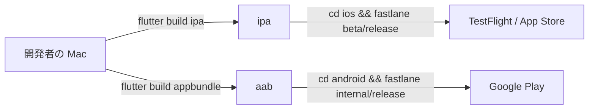
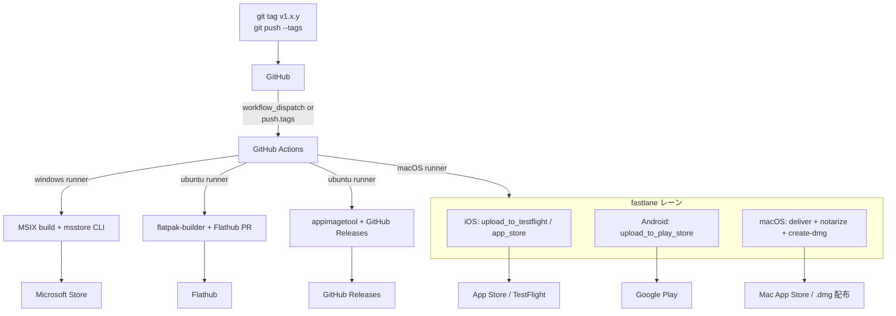

# リリースパイプライン構想

capsicum のリリースを複数プラットフォーム・複数ツールにまたがって一元管理するための構想ドキュメント。デスクトップ対応（[CLAUDE.md 長期構想](CLAUDE.md#長期構想-デスクトップ対応)）の前段階として、全体像を先に描いておくことで実装時の迷いを減らす。

## 目的

capsicum は現状 iOS / Android のモバイル 2 プラットフォームのみだが、長期的には macOS / Linux / Windows のデスクトップにも展開する。配布ツールチェーンはプラットフォームごとに異なり、fastlane 単体での一元管理は不可能。以下の課題に備えて、リリース起点と責務分担を先に決めておく。

- fastlane（Apple / Google 系）と GitHub Actions（Windows / Linux 系）のハイブリッド構成
- リリース起点が複数あると、バージョン整合や手順漏れが発生しやすい
- 手元での fastlane 手動実行と自動化ワークフローの併存

## 現状（v1.14 時点）

iOS と Android の 2 プラットフォームのみで、fastlane ベースの手動リリース。

詳細手順は [store-release-guide.md](store-release-guide.md) を参照。

## 将来像（デスクトップ対応後）

### 全体図

タグプッシュを唯一のリリース起点とし、そこから fastlane レーンと GitHub Actions ワークフローがそれぞれ発火する。

### 責務分担

| プラットフォーム | 担当ツール | 実行環境 | 成果物の行き先 |
| --- | --- | --- | --- |
| iOS | fastlane (`ios/fastlane/Fastfile`) | macOS runner | TestFlight → App Store |
| Android | fastlane (`android/fastlane/Fastfile`) | macOS / Linux runner | Play Store internal → production |
| macOS (App Store) | fastlane `deliver` + `notarize` | macOS runner | Mac App Store |
| macOS (.dmg) | fastlane `create-dmg` + `notarize` + Sparkle 等 | macOS runner | GitHub Releases / 自サイト配布 |
| Windows (Store) | `msstore` CLI + MSIX packaging | Windows runner | Microsoft Store |
| Linux (Flathub) | `flatpak-builder` + Flathub マニフェスト PR | Ubuntu runner | Flathub |
| Linux (AppImage) | `appimagetool` / `linuxdeploy` | Ubuntu runner | GitHub Releases |

Snap Store は[採用しない方針](CLAUDE.md#長期構想-デスクトップ対応)。

## タグ命名規則

タグを唯一のリリース起点とするため、fastlane / GitHub Actions 双方が拾えるフォーマットに統一する。

- リリースタグ: `v{major}.{minor}.{patch}`（例: `v1.15.0`）
- プレリリース（TestFlight 外部テスト等）: `v{major}.{minor}.{patch}-beta.{n}`（例: `v1.15.0-beta.1`）
- ホットフィックス: `v{major}.{minor}.{patch}`（例: `v1.14.1`）

GitHub Actions のワークフロー側で `v*.*.*` にマッチさせる、または `-beta.*` を含むかで分岐する。fastlane はタグからバージョン文字列を抽出して `pubspec.yaml` と照合する運用を想定。

## シークレット管理

各ツールが必要とする認証情報の置き場所は、開発環境とリリース環境で使い分ける。

**開発環境（手元 Mac）**
既存の配置は [dev-environment.md](dev-environment.md) を参照。`~/.config/capsicum/` 配下に App Store Connect API Key と Google Play サービスアカウント JSON を置く運用は維持する。

**GitHub Actions**
プラットフォームが増えたタイミングで、以下を Repository Secrets に追加する。

| 用途 | Secret 名の案 |
| --- | --- |
| App Store Connect API Key | `APP_STORE_CONNECT_API_KEY_P8` |
| App Store Connect Key ID | `APP_STORE_CONNECT_KEY_ID` |
| App Store Connect Issuer ID | `APP_STORE_CONNECT_ISSUER_ID` |
| Google Play サービスアカウント JSON | `GOOGLE_PLAY_SERVICE_ACCOUNT_JSON` |
| Sentry Auth Token（dSYM / マッピング用） | `SENTRY_AUTH_TOKEN` |
| Microsoft Store Partner Center credentials | `MS_STORE_CLIENT_ID` / `MS_STORE_CLIENT_SECRET` / `MS_STORE_TENANT_ID` |
| Flathub PR 用トークン | `FLATHUB_GITHUB_TOKEN` |

macOS 署名・公証用の証明書は Actions の `apple-actions/import-codesign-certs` 等のアクションで Base64 エンコードした p12 を Secret として渡す方式を想定。

## マニュアルトリガーとの併存

タグ駆動の自動化を導入しても、手元での `fastlane beta` 実行は残す。理由は以下のとおり。

- TestFlight への手動テスト配布を即座に行いたい場面がある
- Google Play internal へのクローズドテスト配布を個別に回したい場面がある
- GitHub Actions のクレジット消費を抑えたい

タグ駆動ワークフローは `workflow_dispatch` にも対応させ、GitHub UI から手動実行もできるようにする。手元 fastlane はあくまで補助手段として位置づける。

## 段階的な実装順序

現状から将来像への移行は段階的に進める。

### Phase 1: 現状維持（v1.14〜v1.17）

- 既存の手動 fastlane 運用を継続
- [store-release-guide.md](store-release-guide.md) に書かれている手順をそのまま使う
- この間に fastlane 実行ディレクトリの注意点・バージョン番号管理のルールを明文化する（[store-release-guide.md](store-release-guide.md) 済み）

### Phase 2: モバイル向け GitHub Actions 化（v1.18 前後）

- 既存の fastlane レーンを GitHub Actions から呼び出すワークフローを追加
- タグプッシュをトリガーに iOS / Android の TestFlight / Play Store internal アップロードを自動化
- 本番昇格は引き続き手動（審査提出の判断を挟みたいため）
- macOS runner を使うので、この時点で macOS ネイティブビルドの素振りも同時進行できる

### Phase 3: macOS ネイティブ対応（デスクトップ第1段階）

- macOS デスクトップビルドの fastlane レーン追加
- `deliver` + `notarize` + `create-dmg` の組み合わせで Mac App Store / .dmg 両対応
- Phase 2 の GitHub Actions に macOS ネイティブ分岐を追加

### Phase 4: Windows / Linux 対応（デスクトップ第3段階）

- GitHub Actions に Windows runner / Ubuntu runner のジョブを追加
- Microsoft Store 向け MSIX ビルド + msstore CLI
- Flathub 向け flatpak-builder + マニフェスト PR
- AppImage 向け appimagetool + GitHub Releases 添付

## 未確定事項

- **Phase 2 の実施時期**: v1.15 は既に詰まっており、v1.16 / v1.17 も大更新ルールで制限がある。v1.18 仮配置の [#52](https://github.com/pooza/capsicum/issues/52) Stage 1 と並行して Phase 2 を進めるのが自然か
- **fastlane match の導入**: 現在は Automatic Signing で運用しているが、GitHub Actions で署名する場合は証明書管理を `match` に寄せる選択肢がある。手元の Xcode 挙動との兼ね合いを見て判断
- **バージョン番号（`+N`）の自動インクリメント**: `pubspec.yaml` の `1.15.0+35` 形式のビルド番号はストアにアップロードすると再利用不可。手動更新では事故が起きやすいので、タグから自動生成する仕組みを検討
