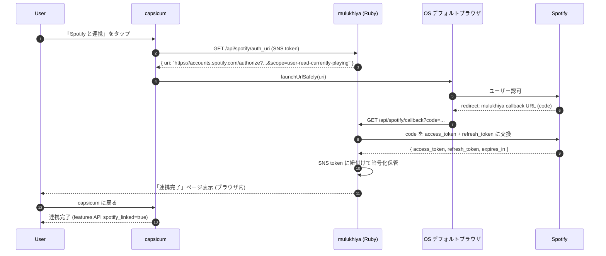
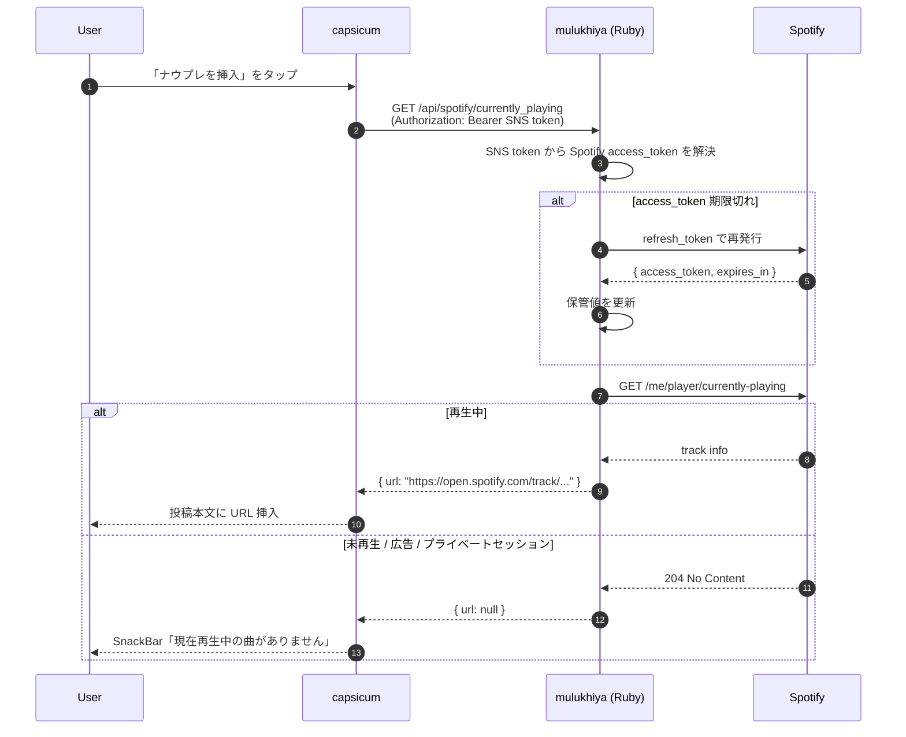

# Spotify Web API ナウプレ取得 設計

## 位置付け

- 対象: capsicum 全プラットフォーム (OS 非依存、HTTP のみで完結)
- [#465](https://github.com/pooza/capsicum/issues/465) の方針確定。Annict OAuth (mulukhiya 経由) と同じパターンで実装する
- 既存の macOS Share Extension ([#422](https://github.com/pooza/capsicum/issues/422)) は **push 型**、本機能は **pull 型**。UX 上は併存
- 将来 [#466](https://github.com/pooza/capsicum/issues/466) NowPlayingProvider 抽象 + Linux MPRIS と統合する際は、Spotify を「OS 非依存 fallback」として保持する想定

## 全体アーキ

### 連携 (OAuth Authorization Code)

### ナウプレ取得 (Bearer 経由)

### 要点

- **Spotify client_secret はモロヘイヤ側に保管**、capsicum 側には漏らさない。Annict と同じ「サーバー保管型 OAuth」方針
- access_token は 3600s で expire するため、mulukhiya 内部で refresh_token による自動更新を隠蔽 (capsicum 側は意識しない)
- 再生状態の判定 (未再生 / 広告 / プライベート) も mulukhiya 側で吸収し、capsicum は `url` の有無だけ見れば良い

## なぜモロヘイヤ経由か

- **client_secret の保護**: capsicum 側 (配布されるバイナリ) に置けば抽出されうる。サーバ側で保管すれば安全
- **token refresh の自動化**: Spotify access_token は 3600s で expire。refresh_token を使った再取得を mulukhiya 側で隠蔽できる
- **Annict pattern との整合**: 既存 OAuth (Annict) と同じユーザー体験 (mulukhiya にログイン中の SNS token を渡してリンク)
- **プリセットサーバー以外のユーザー**: 自前 mulukhiya インスタンスを持っていない場合は使えない (Annict と同じ制約)。許容する

## 既存 mulukhiya Spotify との関係

| | 既存 | 新規 (本設計) |
|---|---|---|
| クラス | `SpotifyService` | `SpotifyUserService` (仮称、新設) |
| 認証 | app-level (Client Credentials) | user-level OAuth (Authorization Code) |
| 用途 | track search / lookup | currently-playing |
| client_id/secret | 既存設定流用 | **同じ Spotify アプリで OK** (Spotify Developer Dashboard で redirect_uri と scope を追加すれば 1 アプリで両対応) |
| token 保管 | 不要 (app-level は seasonal refresh) | 必須 (per-user、暗号化、refresh_token と共に) |

既存設定の `service/spotify/client_id` / `service/spotify/client_secret` を流用しつつ、Spotify Developer Dashboard で:
- Redirect URI に mulukhiya 側のコールバック URL を追加
- Scope 設定 `user-read-currently-playing` を追加

## capsicum 側の変更

### Provider / Service

- `lib/src/provider/spotify_provider.dart` (新設):
  - `spotifyAuthStateProvider` (linked / unlinked)
  - `spotifyCurrentlyPlayingProvider` (FutureProvider, on-demand fetch)

### UI

- **設定画面**: Annict 連携と同じ UX で「Spotify 連携」セクション追加
  - 「連携する」→ OS デフォルトブラウザ起動 → 認可後 code をペーストするダイアログ → 完了
  - 「連携解除」ボタン
- **compose 画面**: 「ナウプレを挿入」ボタンを追加 (既存 `annictEnabled` フラグと同じ系列で `spotifyEnabled` フラグを mulukhiya から取得)
  - 押下 → `mulukhiya.getSpotifyCurrentlyPlaying(snsToken)` → 取得した URL を本文に挿入
  - 何も再生していない → SnackBar 「現在再生中の曲がありません」
  - 未認証 → SnackBar 「設定画面で Spotify と連携してください」 + 設定画面への動線

### compose_screen.dart の改修ポイント

既存 `compose_screen.dart:933` の `annictEnabled` と並列に `spotifyEnabled` を渡す。ボタン配置は `compose_screen.dart:2085` 周辺 (Annict episode browser ボタンの隣)。

### macOS Share Extension との UX 棲み分け

- macOS Share Extension: Spotify アプリの「共有」メニューから capsicum を選んだ際の **push 型** 起点
- 本機能: compose 画面で能動的に「ナウプレを挿入」ボタンを押す **pull 型** 起点

両方残す。UX 上は競合せず、ユーザーがどちらの起点でも投稿フォームに到達する。

## モロヘイヤ側の変更

詳細は別 issue [pooza/mulukhiya-toot-proxy](https://github.com/pooza/mulukhiya-toot-proxy/issues/) で扱う。capsicum 側からの要求点:

| エンドポイント | 用途 | 引数 | 戻り値 |
|---|---|---|---|
| `GET /api/spotify/auth_uri` | OAuth URI 取得 | sns_token (Authorization header) | `{ "uri": "https://accounts.spotify.com/authorize?..." }` |
| `POST /api/spotify/auth` | 認証完了 | sns_token, spotify_code | `{ "success": true }` |
| `GET /api/spotify/currently_playing` | 現在再生中の URL | sns_token | `{ "url": "https://open.spotify.com/track/..." }` または `{ "url": null }` (何も再生していない時) |
| `DELETE /api/spotify/auth` | 連携解除 | sns_token | `{ "success": true }` |
| `GET /api/spotify/status` | 連携状態 (`features.spotify` フラグに統合可) | sns_token | `{ "linked": true/false }` |

### 既存 features API への統合

既存の `mulukhiya.annictEnabled` と同じ場所 (おそらく `/api/features` 相当) に `spotify_enabled` (mulukhiya インスタンス全体で Spotify Developer 登録が完了しているか) と `spotify_linked` (当該ユーザーが連携済みか) を追加。compose_screen の判定ロジックを共通化する。

### token 保管

memory `feedback_mulukhiya_simple_inserts_only.md` 「モロヘイヤ DB 書き込みは単純 INSERT のみ」を守る。Annict の既存パターン (おそらく `user_secrets` テーブルに encrypted token カラム / または専用テーブル) を踏襲。INSERT/UPDATE は単純孤立で、副作用列挙可能な形にする。

### Spotify Developer Dashboard 設定

mulukhiya 側で:
- 既存 Spotify アプリ (`/service/spotify/client_id` で参照中) に **Redirect URI を追加**
  - 例: `https://relay.capsicum.shrieker.net/api/spotify/callback` (capsicum-relay とは別、mulukhiya 側のホスト)
- Scopes 設定に `user-read-currently-playing` を追加

これは pooza 手動操作 (Spotify Developer Dashboard ログイン)。

## エッジケース

| ケース | 想定挙動 |
|---|---|
| token expire (3600s 経過) | mulukhiya 内部で refresh_token を使って自動更新。capsicum 側は意識しない |
| refresh_token も失効 | 401 を mulukhiya が返す → capsicum 側で「再認証してください」表示 |
| Spotify Free アカウント | `/me/player/currently-playing` は Free でも動作するため OK |
| 何も再生していない / 広告再生中 | `{ "url": null }` で返す。capsicum 側は「現在再生中の曲がありません」表示 |
| プライベートセッション中 | currently-playing は空が返る可能性、上と同じ扱い |
| ネットワーク失敗 | 既存の Annict と同じエラー処理 (SnackBar 「取得に失敗しました」) |

## セキュリティ

- Spotify client_secret は mulukhiya のみ保持、capsicum 側に漏らさない
- mulukhiya 側で保管する Spotify token は既存の暗号化方式 (Annict token と同じ) を流用
- capsicum から mulukhiya への API 呼び出しは HTTPS + SNS access_token (既存パターン) で認証

## 実装フェーズ

1. **mulukhiya 側 (先行)**:
   - Spotify Developer Dashboard 設定 (pooza 手動)
   - `SpotifyUserService` 新設
   - `/api/spotify/*` エンドポイント実装
   - token 保管 (Annict パターン踏襲)
   - 既存 `features` API に `spotify_enabled` / `spotify_linked` 追加
   - デプロイ (4 プリセットサーバー)
2. **capsicum 側 (mulukhiya デプロイ後)**:
   - `mulukhiya` パッケージに `getSpotifyOAuthUri` / `authenticateSpotify` / `getSpotifyCurrentlyPlaying` / `unlinkSpotify` 追加
   - 設定画面に「Spotify 連携」セクション追加
   - compose 画面に「ナウプレを挿入」ボタン追加
3. **動作検証**: 内部ベータ (TestFlight / Android internal track / Linux AppImage / Windows MSIX) で pooza 検証

## 関連 issue

- 本設計の親: [#465](https://github.com/pooza/capsicum/issues/465) (本設計の確定で close)
- 実装 issue (capsicum 側): #未起票 (本設計確定後に切り出し)
- 実装 issue (mulukhiya 側): pooza/mulukhiya-toot-proxy リポジトリに別途起票
- macOS Share Extension (push 型): [#422](https://github.com/pooza/capsicum/issues/422)
- NowPlayingProvider 抽象 + Linux MPRIS: [#466](https://github.com/pooza/capsicum/issues/466)
- Windows SMTC (on-hold): [#484](https://github.com/pooza/capsicum/issues/484)
